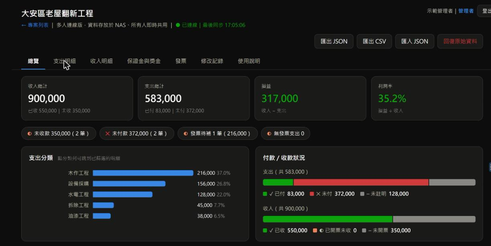
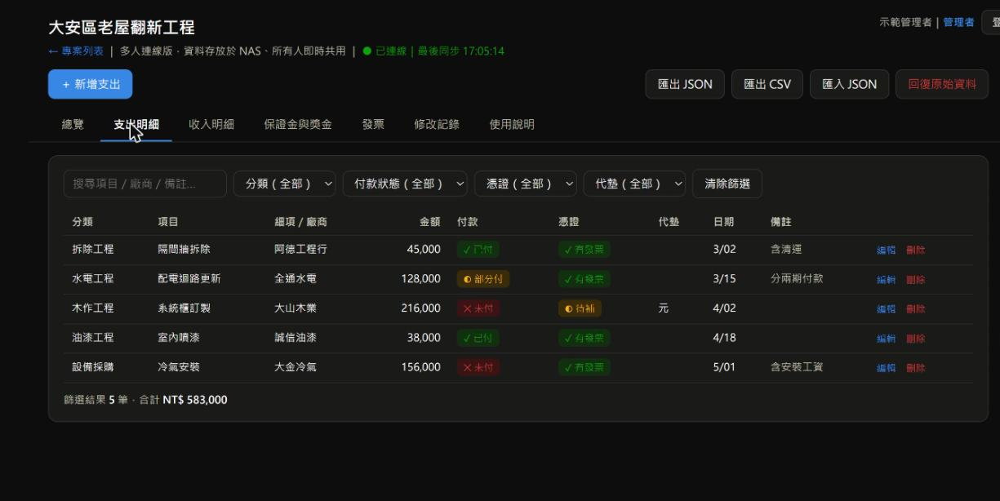
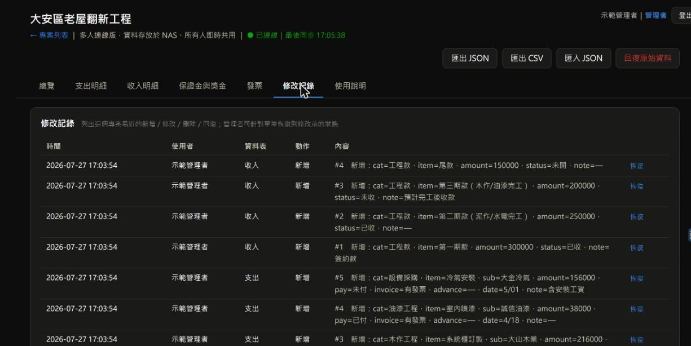

# 工程收支帳務系統

工程／裝修類收支管理系統。啟動後在自己的電腦上跑一個小型伺服器，家人、夥伴用手機或電腦打開同一個網址，看到、修改的都是同一份資料，即時同步，不需要另外傳 Excel 或對版本。

只用 Python 3 標準函式庫（`http.server` + `sqlite3`），不需要安裝任何額外套件。

詳細安裝步驟與使用教學請看 [`使用手冊.html`](使用手冊.html)（下載後直接用瀏覽器開啟即可）。以下是快速版本。

> 覺得好用的話，麻煩點一下右上角的 ⭐ **Star**——這是讓我知道這個小工具有沒有人在用的唯一方式。

## 畫面預覽

| 總覽 | 支出明細 | 修改記錄與復原 |
| --- | --- | --- |
|  |  |  |

（圖中為示範資料，非真實工程資料）

## 快速開始

1. 安裝 [Python 3](https://www.python.org/downloads/)（Windows 安裝時記得勾選 **Add python.exe to PATH**）
2. 下載這個 repo（Code → Download ZIP，或 `git clone`）
3. 啟動伺服器：
   - **Windows**：雙擊 `啟動-Windows.bat`
   - **Mac**：雙擊 `啟動-Mac.command`（第一次可能要到「系統設定 → 隱私權與安全性」允許執行）
4. 瀏覽器打開 `http://localhost:8123`，第一次會看到「建立管理者帳號」畫面，設定好帳號密碼即可
5. 手機連到**同一個 Wi-Fi**，瀏覽器打開 `http://電腦的區網IP:8123`，就能跟電腦共用同一份資料

## 功能

- 多專案：首頁可以同時管理好幾個工程案，各案資料互相獨立
- 收入／支出／保證金記帳，多人連線即時同步
- 帳號權限：一般使用者可新增修改，管理者可刪除、匯入/匯出、管理帳號
- 修改記錄與復原：每筆新增／修改／刪除都留有紀錄，改壞了可以恢復
- 發票拍照自動辨識（選用）：呼叫 Google Gemini Vision 辨識店家、日期、金額、統編，需自行申請免費 API 金鑰（見使用手冊）

## 資料存放

啟動後會在 `ledger/data/` 產生 `projects.json`、各專案的 SQLite 資料庫、帳號清單等，這個資料夾就是你的完整資料，定期備份複製它即可。這個資料夾不會被這個 repo 追蹤（見 `.gitignore`）。

## 安全提醒

沒有 HTTPS 加密，只適合家用或內網環境；不要把連接埠（預設 8123）對外網開放，也不要把 `ledger/data/` 或 `API.txt` 上傳到公開的地方。

## License

MIT
